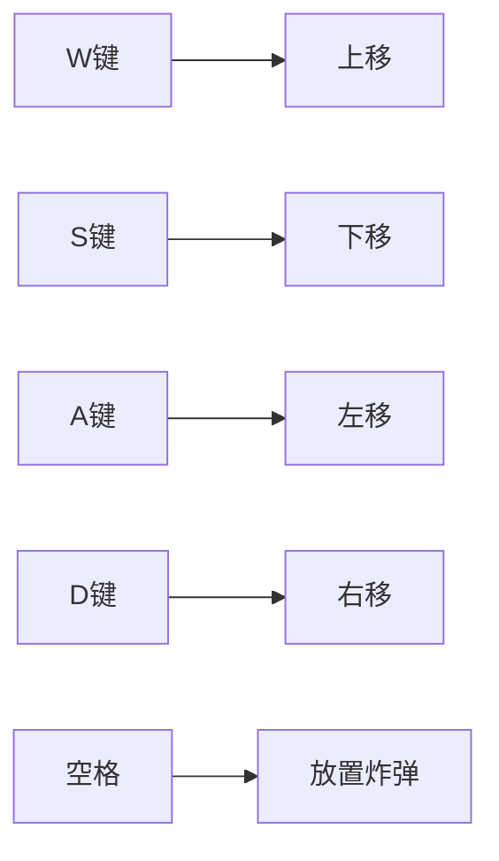

# 游戏设计文档 - BombCat

## 一、核心玩法
### 1.1 操作控制


### 1.2 炸弹参数（Unity Inspector配置示例）
| 参数名 | 类型 | 默认值 | 说明 |
|--------|------|--------|-----|
| BlastRadius | float | 3.0 | 爆炸半径 |
| ExplodeDelay | int | 3 | 倒计时(秒) |
| ChainExplode | bool | true | 是否允许连锁爆炸 |

### 1。3 角色参数
| 参数名 | 类型 | 默认值 | 说明 |
|--------|------|--------|-----|
| MoveSpeed | float | 3.0 | 基础移动速度（单位/秒） |
| CurrentHealth | int | 3 | 当前生命值 |
| MaxHealth | int | 5 | 最大生命值上限 |
| InitialHealth | int | 3 | 初始生命值 |
| MaxBombCount | int | 1 | 可同时放置的炸弹数量 |
| PlaceCooldown | float | 2.0 | 放置炸弹的整体冷却时间（秒） |
| PerBombCooldown | float | 0.5 | 单个炸弹的放置间隔（秒） |
| GameTimer | int | 180 | 游戏总倒计时（秒） |
| InvincibleDuration | float | 1.5 | 受伤后的无敌时间（秒） |

### 1.4 道具参数
#### 1.4.1 增益道具参数
| 道具名称 | 类型 | 参数 | 效果 | 持续时间 |
|---------|------|-----|------|---------|
| SpeedUp | 移动速度 | +2.0 | 移动速度提升 | 20秒 |
| BombCount+ | 炸弹容量 | +1 | 可放置炸弹数+1 | 永久 |
| Heal | 生命恢复 | +1 | 恢复1点生命值 | 立即生效 |
| BlastUp | 爆炸范围 | +1.5 | 炸弹爆炸半径增加 | 永久 |
| FasterBoom | 爆炸加速 | -1.0 | 炸弹倒计时减少1秒 | 永久 |
| TimeExtend | 游戏时间 | +30 | 增加总倒计时 | 立即生效 |

#### 1.4.2 负面道具参数
| 道具名称 | 类型 | 参数 | 效果 | 持续时间 |
|---------|------|-----|------|---------|
| SpeedDown | 移动速度 | -1.5 | 移动速度降低 | 15秒 |
| TimeReduce | 游戏时间 | -20 | 减少总倒计时 | 立即生效 |
| InstantBoom | 炸弹引爆 | 半径3.0 | 立即触发范围内炸弹爆炸 | 立即生效 |

### 1.5 敌人参数
| 敌人名称 | 类型 | 移动速度 | 伤害值 | 攻击方式 | 备注 |
|---------|------|---------|-------|----------|-----|
| 史莱姆 | Slime | 1.2 | 1 | 接触伤害 | 可被炸弹摧毁 |
| 恶犬 | Hound | 4.5 | 2 | 追踪玩家 | 免疫自身爆炸伤害 |

### 1.X 胜利条件公式
```csharp
// 计算破坏率的代码示例
public void CalculateDestruction() {
    int totalTiles = tilemap.GetUsedTilesCount(); 
    int destroyedTiles = tilemap.GetDestroyedTiles();
    destructionRate = (destroyedTiles / (float)totalTiles) * 100;
}
```

## 二、关卡原型
![关卡原型图]
（用Unity的Tilemap绘制后截图保存到此路径）
