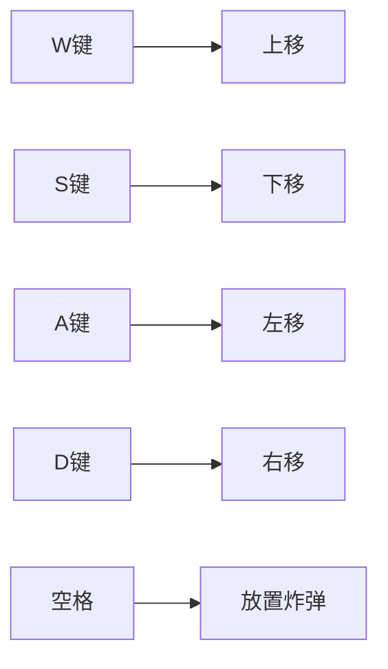

# 游戏设计文档 - BombCat

## 一、核心玩法
### 1.1 操作控制


### 1.2 炸弹参数（Unity Inspector配置示例）
| 参数名 | 类型 | 默认值 | 说明 |
|--------|------|--------|-----|
| BlastRadius | float | 3.0 | 爆炸半径 |
| ExplodeDelay | int | 3 | 倒计时(秒) |
| ChainExplode | bool | true | 是否允许连锁爆炸 |

### 1.3 胜利条件公式
```csharp
// 计算破坏率的代码示例
public void CalculateDestruction() {
    int totalTiles = tilemap.GetUsedTilesCount(); 
    int destroyedTiles = tilemap.GetDestroyedTiles();
    destructionRate = (destroyedTiles / (float)totalTiles) * 100;
}
```

## 二、关卡原型
  
（用Unity的Tilemap绘制后截图保存到此路径）
